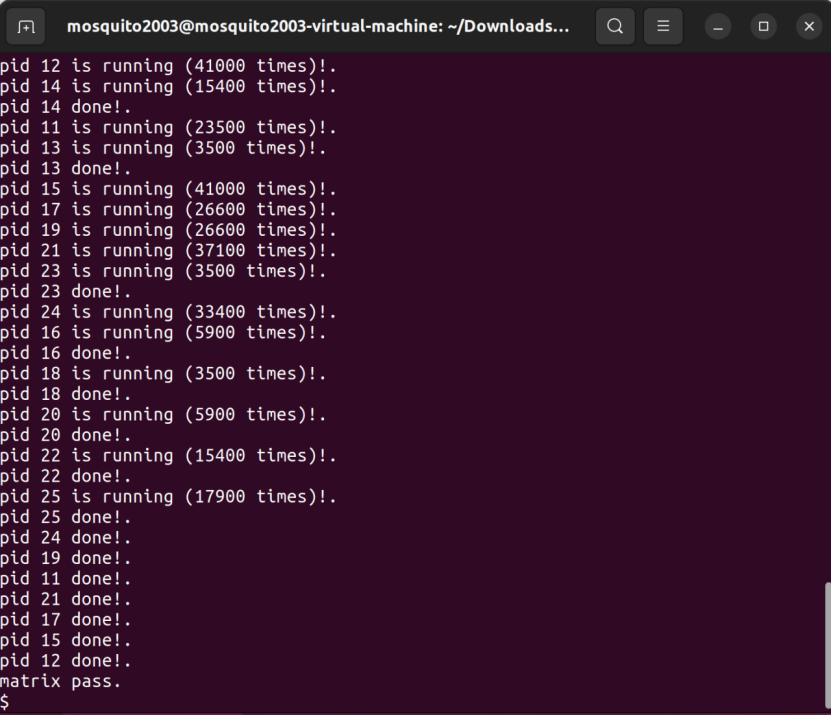

# Lab8
## 实验目的
* 了解文件系统抽象层-VFS的设计与实现
* 了解基于索引节点组织方式的Simple FS文件系统与操作的设计与实现
* 了解“一切皆为文件”思想的设备文件设计
* 了解简单系统终端的实现

## 练习1: 完成读文件操作的实现（需要编码）
首先了解打开文件的处理流程，然后参考本实验后续的文件读写操作的过程分析，填写在 kern/fs/sfs/sfs_inode.c中 的sfs_io_nolock()函数，实现读文件中数据的代码。

##### 总体来说，根据文件系统的架构，对文件的操作是在四个层次之间进行交互的。首先需要通过文件系统的通用文件系统访问接口层给用户空间提供的访问接口进入文件系统内部，接着由文件系统抽象层VFS把访问请求转发给某一具体文件系统（SFS），具体文件系统把应用程序的访问请求转化为对磁盘上的 block 的处理请求，并通过外设接口层交给磁盘驱动例程来完成具体的磁盘操作。  
#### 打开文件的处理流程
函数调用流程大致如下：  
`open`->`sys_open`->`syscall`->内核`sys_open`->`sysfile_open`->`file_open`->`vfs_open`->`vfs_lookup`/`sfs_lookup`->`vop_open`->`sfs_open`  

##### 用户态
当用户在用户进程中想要进行打开文件的操作，调用系统库函数open时，首先在通用文件访问接口层进行处理，调用用户态函数sys_open->syscall，从而引起系统调用进入到内核态。  
##### 内核态
进入内核态之后，通过中断处理例程，调用sys_open内核函数，并进一步调用sysfile_open内核函数，进入到文件系统抽象层处理流程完成进一步读文件的操作。  
##### 文件系统抽象层
sysfile_open函数把位于用户空间的字符串__path拷贝到内核空间中的字符串path中，然后调用file_open函数。在file_open中，通过解析传入的参数open_flags来设置读写操作的变量readable、writable。调用fd_array_alloc函数在当前进程中分配一个空闲的文件描述符，以待后面的使用。之后再调用vfs_open, 使用了VFS的接口,进入到文件系统抽象层的处理流程完成进一步的打开文件操作。

vfs_open函数通过调用vfs_lookup找到path对应文件的inode，再调用vop_open函数打开文件。vfs_lookup中首先调用了get_device函数，对路径进行解析，进一步调用vfs_get_bootfs函数找到根目录“/”对应的inode。这个inode就是位于vfs.c中的inode变量bootfs_node。
##### SFS文件系统层
之后通过vop_lookup函数转发，进一步调用SFS中的函数sfs_lookup，其调用sfs_lookup_once函数查找根目录下的文件sfs_filetest1对应的inode节点。当无法分解path后，就意味着找到了对应的inode节点，返回此索引节点。vop_open函数也会最终进入到SFS层调用sfs_open函数完成具体的打开文件操作。

成功打开后，逐层向上返回到file_open函数，继续设置文件结构file的相关变量，并修改状态为打开。最终返回到用户空间，完成了全部的文件打开过程。  

#### 读写文件的处理流程
函数调用流程大致如下，以read为例：  
`read`->`sys_read`->`syscall`->内核`sys_read`->`sysfile_read`->`file_read`->`vop_read`->`sfs_read`->`sfs_io`->`sfs_io_nolock`->`sfs_rbuf`/`sfs_rblock`->`disk0_read_blks_nolock`->`ide_read_sec`   

##### 用户态
用户态程序调用系统库函数read，该函数进一步调用sys_read函数，从而调用syscall引起系统调用进入到内核态。  
##### 内核态
进入内核态之后，通过中断处理例程，会调用sys_read内核函数，并进一步调用sysfile_read内核函数，进入到文件系统抽象层处理流程完成进一步读文件的操作。  
##### 文件系统抽象层
sysfile_read函数首先检查读取长度是否为0、文件是否可读。之后调用kmalloc分配4096字节的buffer空间。然后开始循环读取文件，每次循环中先检查剩余部分大小，若其小于4096字节，则只读取剩余部分的大小。然后调用file_read函数将文件内容读取到buffer中。

file_read函数首先调用fd2file函数找到对应的file结构，并检查是否可读。调用filemap_acquire函数使打开这个文件的计数加1。调用vop_read函数将文件内容读到iob结构中，并且调整文件指针偏移量pos，使其向后移动实际读到的字节数iobuf_used(iob)。最后调用filemap_release函数使打开这个文件的计数减1，若打开计数为0，则释放file。  
##### SFS文件系统层
vop_read()函数转发给了SFS文件系统层的sfs_read函数。在sfs_read函数中，调用了sys_io函数。sfs_io函数先找到inode对应的sfs和sin，然后调用sfs_io_nolock函数进行读取文件操作（具体分析见下），最后调用iobuf_skip函数调整iobuf的指针位置。

读取完成后，向上返回至sysfile_read函数，继续调用copy_to_user函数将读到的内容拷贝到用户的内存空间中，直至指定长度len读取完成。最后函数调用层层返回至用户程序，用户程序收到了读到的文件内容，完成了从磁盘中读取数据到内存指定位置的全部过程。  

#### sfs_io_nolock()函数
sfs_io_nolock函数中，首先获取了文件inode对应的磁盘inode，并计算出了读写操作的结束位置endpos = offset + alenp，以及一些合法检查。  
根据要进行的操作类型，设置了后需要调用读还是写相关的函数(sfs_wbuf/sfs_wblock/sfs_rbuf/sfs_rblock)。  
接下来根据读写块的三种类型，进行具体的读写操作。  
##### 1. 起始位置与块不对齐  
   如果偏移量与第一个块不对齐，从偏移位置读取/写入一些内容直到第一个块的末尾，这样后面就可以读写完整的块了。  
   ```c++
   size = (nblks != 0) ? (SFS_BLKSIZE - blkoff) : (endpos-offset);
   ```
   读写大小size分为两种情况，如果nblks不为0，说明不是最后一块，那么size=SFS_BLKSIZE - blkoff，即为图上红色阴影部分。  
     
   如果nblks为0，说明开始时就是最后一块，那么size=endpos-offset，即为图上红色阴影部分。  
     
##### 2. 完整的对齐的块  
   每次读写的大小都为 SFS_BLKSIZE = 4096
##### 3. 剩余的不对齐的块  
   如果结束位置与最后一个块不对齐，从开始位置读取/写入一些内容到最后一个块的 (endpos % SFS_BLKSIZE) 处。

在进行读写时，首先调用sfs_bmap_load_nolock函数，获取数据块对应到磁盘上的数据块的inode号。sfs_bmap_load_nolock函数将对应sfs_inode的第index个索引指向的block的索引值取出存到相应的指针指向的单元（ino_store）。它调用sfs_bmap_get_nolock来完成相应的操作。  

对于不完整的块，调用sfs_buf_op函数进行具体的读写操作，完整的块调用的则是sfs_block_op函数。以read操作为例，sfs_rbuf和sfs_rblock函数最终都调用sfs_rwblock_nolock函数完成操作，而sfs_rwblock_nolock函数调用dop_io->disk0_io->disk0_read_blks_nolock->ide_read_secs完成对磁盘的操作。最终会进入到外设层，对磁盘进行读写。  

补充的函数部分如下：  
```c++
static int sfs_io_nolock(struct sfs_fs *sfs, struct sfs_inode *sin, void *buf, off_t offset, size_t *alenp, bool write)
{
    int ret = 0;
    size_t size, alen = 0;
    uint32_t ino;
    //起始块号
    uint32_t blkno = offset / SFS_BLKSIZE;         // The NO. of Rd/Wr begin block
    //要读取/写入的块数
    uint32_t nblks = endpos / SFS_BLKSIZE - blkno; // The size of Rd/Wr blocks

    //(1)起始块
    if ((blkoff = offset % SFS_BLKSIZE) != 0){
        //如果不是最后一块size=块大小-操作偏移量；如果是最后一块size=结束长度-总偏移量
        size = (nblks != 0) ? (SFS_BLKSIZE - blkoff) : (endpos-offset);
        //获取这些数据块对应到磁盘上的数据块的inode号
        if((ret = sfs_bmap_load_nolock(sfs, sin, blkno, &ino)) != 0){
            goto out;
        }
        //对缓冲区进行读或写操作
        if((ret = sfs_buf_op(sfs, buf, size, ino, blkoff)) != 0){
            goto out;
        }
        //已经完成读写的数据长度
        alen += size;
        //如果这是最后操作的块，out结束
        if(nblks == 0){
            goto out;
        }
        //否则，更新缓冲区
        buf += size;
        blkno++;
        nblks--;
    }
    //（2）对齐块
    size = SFS_BLKSIZE;
    while(nblks != 0){
        //获取磁盘上块的编号
        if((ret = sfs_bmap_load_nolock(sfs, sin, blkno, &ino)) != 0){
            goto out;
        }
        //对数据块进行读或写操作
        if((ret = sfs_block_op(sfs, buf, ino, 1)) != 0){
            goto out;
        }
        //更新
        alen += size;
        buf += size;
        blkno ++;
        nblks --;
    }
    //（3）不对齐的最后一块
    if((size = endpos % SFS_BLKSIZE) != 0){
        //获取磁盘上的块号
        if((ret = sfs_bmap_load_nolock(sfs, sin, blkno, &ino)) != 0){
            goto out;
        }
        //缓冲区读写操作
        if((ret = sfs_buf_op(sfs, buf, size, ino, 0)) != 0){
            goto out;
        }
        //更新
        alen += size;
    }
out:
    *alenp = alen;
    //如果操作导致文件大小增加，更新SFS inode的大小和标记为脏（dirty）
    if (offset + alen > sin->din->size)
    {
        sin->din->size = offset + alen;
        sin->dirty = 1;
    }
    return ret;
}
```

## 练习2: 完成基于文件系统的执行程序机制的实现（需要编码）
改写proc.c中的load_icode函数和其他相关函数，实现基于文件系统的执行程序机制。执行：make qemu。如果能看看到sh用户程序的执行界面，则基本成功了。如果在sh用户界面上可以执行”ls”,”hello”等其他放置在sfs文件系统中的其他执行程序，则可以认为本实验基本成功。

#### load_icode函数
(1) 为当前进程创建一个新的内存管理结构（mm）。  
(2) 创建一个新的页目录表（PDT），并将mm->pgdir设置为PDT对应的内核虚拟地址。  
(3) 将可执行文件的TEXT/DATA/BSS部分复制到进程的内存空间中。  
(3.1) 从文件中读取原始数据内容并解析elfhdr（调用load_icode_read）。  
```c++
struct elfhdr __elf, *elf = &__elf;
if ((ret = load_icode_read(fd, elf, sizeof(struct elfhdr), 0)) != 0)
{
    goto bad_elf_cleanup_pgdir;
}
```

(3.2) 根据elfhdr中的信息，从文件中读取原始数据内容并解析proghdr。根据ELF头中给出的程序头表偏移量，获取程序头表的位置，并解析出其中的各个段的信息。
```c++
struct proghdr __ph, *ph = &__ph;
uint32_t vm_flags, perm, phnum;
for (phnum = 0; phnum < elf->e_phnum; phnum++)
{
    off_t phoff = elf->e_phoff + sizeof(struct proghdr) * phnum;
    if ((ret = load_icode_read(fd, ph, sizeof(struct proghdr), phoff)) != 0)
    {
        goto bad_cleanup_mmap;
    }
……
}
```
(3.3) 调用mm_map函数建立与TEXT/DATA相关的虚拟内存区域（vma）。
```c++
if (vm_flags & VM_READ)
    perm |= PTE_R;
if (vm_flags & VM_WRITE)
    perm |= (PTE_W | PTE_R);
if (vm_flags & VM_EXEC)
    perm |= PTE_X;
```
(3.4) 调用pgdir_alloc_page函数为TEXT/DATA分配页，并将文件中的内容读取到新分配的页中。
```c++
while (start < end)
{
    if ((page = pgdir_alloc_page(mm->pgdir, la, perm)) == NULL)
    {
        ret = -E_NO_MEM;
        goto bad_cleanup_mmap;
    }
    off = start - la, size = PGSIZE - off, la += PGSIZE;
    if (end < la)
    {
        size -= la - end;
    }
    if ((ret = load_icode_read(fd, page2kva(page) + off, size, offset)) != 0)
    {
        goto bad_cleanup_mmap;
    }
    start += size, offset += size;
}
```
(3.5) 调用pgdir_alloc_page函数为BSS分配页，并在这些页中填充零值。  
(4) 调用mm_map函数设置用户栈，并将参数放入用户栈中。  
(5) 设置当前进程的mm、cr3和pgidr（使用lcr3宏进行重置）。  
(6) 在用户栈中设置uargc和uargv。  
```c++
uint32_t argv_size = 0, i;
for (i = 0; i < argc; i++)
{
    argv_size += strnlen(kargv[i], EXEC_MAX_ARG_LEN + 1) + 1;
}
//新建的用户栈
uintptr_t stacktop = USTACKTOP - (argv_size / sizeof(long) + 1) * sizeof(long);
char **uargv = (char **)(stacktop - argc * sizeof(char *));

argv_size = 0;
for (i = 0; i < argc; i++)
{
    uargv[i] = strcpy((char *)(stacktop + argv_size), kargv[i]);
    argv_size += strnlen(kargv[i], EXEC_MAX_ARG_LEN + 1) + 1;
}

stacktop = (uintptr_t)uargv - sizeof(int);
*(int *)stacktop = argc;
```
(7) 为用户环境设置trapframe。  

其中调用的load_icode_read函数分析如下：  
```c++
static int
load_icode_read(int fd, void *buf, size_t len, off_t offset)
{
    int ret;
    if ((ret = sysfile_seek(fd, offset, LSEEK_SET)) != 0)
    {
        return ret;
    }
    if ((ret = sysfile_read(fd, buf, len)) != len)
    {
        return (ret < 0) ? ret : -1;
    }
    return 0;
}
```

参数：
* int fd：文件描述符    
* void *buf：缓冲区
* size_t len：读取长度
* off_t offset：偏移量

先调用sysfile_seek()函数将返回值赋给ret，sysfile_seek()函数调用了file_seek()函数去更改文件操作的起始点，sysfile_seek()返回值为0则说明更改文件操作起始点成功，进入sysfile_read()函数读取数据。sysfile_read()参数为：
* int fd：文件描述符
* void *buf：缓冲区
* size_t len：读取长度

函数内容为：
```c++
int sysfile_read(int fd, void *base, size_t len)
{
    struct mm_struct *mm = current->mm;
    //检查读取长度是否为0
    if (len == 0)
    {
        return 0;
    }
    //检查文件是否可读
    if (!file_testfd(fd, 1, 0))
    {
        return -E_INVAL;
    }
    //分配buffer空间，调用kmalloc函数分配4096字节的buffer空间
    void *buffer;
    if ((buffer = kmalloc(IOBUF_SIZE)) == NULL)
    {
        return -E_NO_MEM;
    }

    int ret = 0;
    //copied为已读字节，alen为将读字节
    size_t copied = 0, alen;
    //循环读取文件
    while (len != 0)
    {
        //每次读取buffer大小
        //如果剩余部分小于4096字节，则只读取剩余部分
        if ((alen = IOBUF_SIZE) > len)
        {
            alen = len;
        }
        //调用file_read函数将文件内容读取到buffer中，alen为实际大小
        ret = file_read(fd, buffer, alen, &alen);
        if (alen != 0)
        {
            lock_mm(mm);
            {
                //调用copy_to_user函数将读取到的内容拷贝到用户的内存空间中
                if (copy_to_user(mm, base, buffer, alen))
                {
                    assert(len >= alen);
                    //指针进行移动，剩余字节和已读字节都要调整
                    base += alen, len -= alen, copied += alen;
                }
                else if (ret == 0)
                {
                    ret = -E_INVAL;
                }
            }
            unlock_mm(mm);
        }
        //读取失败或者读取完成就跳出循环
        if (ret != 0 || alen == 0)
        {
            goto out;
        }
    }
//函数调用层返回至用户程序
out:
    kfree(buffer);
    if (copied != 0)
    {
        return copied;
    }
    return ret;
}
```

#### 执行结果展示
仅展示以下四个命令的结果。  
1. hello
  
2. matrix

3. forktest
   
4. yield


## 扩展练习 Challenge2：完成基于“UNIX的软连接和硬连接机制”的设计方案
如果要在ucore里加入UNIX的软连接和硬连接机制，至少需要定义哪些数据结构和接口？在网络上查找相关的Linux资料和实现，请在实验报告中给出设计实现”UNIX的软连接和硬连接机制“的概要设方案。  

##### 软连接和硬连接区别
* 硬连接
    * 文件有相同的 inode 及 data block;只能对已存在的文件进行创建，
    * 不能交叉文件系统进行硬连接的创建，
    * 不能对目录进行创建，只可对文件创建，
    * 删除一个硬连接文件并不影响其他有相同 inode 号的文件

硬连接的作用是允许一个文件拥有多个有效路径名，这样用户就可以建立硬连接到重要文件,以防止“误删”的功能。  
* 软连接
    * 软连接有自己的文件属性及权限等，软连接的inode指向的数据块保存的是原文件的路径
    * 可对不存在的文件或目录创建软连接
    * 软连接可交叉文件系统
    * 软连接可对文件或目录创建,
    * 创建软连接时，连接计数 i nlink 不会增加;
    * 删除软连接并不影响被指向的文件，但若被指向的原文件被删除，则相关软连接被称为死连接，若被指向路径文件被重新创建，则该软连接正常恢复

软连接的作用相当于Windows上的快捷方式创建。   

##### 设计实现方案  
保存在磁盘上的inode信息均存在一个 nlinks 变量用于表示当前文件的被连接的计数，因而支持实现硬连接和软连接机制
* 创建硬连接link时，为new path创建对应的file，并把其inode指向old path所对应的inode,inode的引用计数加1.
* 创建软连接link时，创建一个新的文件(inode不同)，并把old path的内容存放到文件的内容中去，给该文件保存在磁盘上时disk inode类型为SFS TYPE LINK，再完善对于该类型inode的操作即可。
* 删除一个软连接B的时候，直接将其在磁盘上的inode删掉即可，但删除一个硬连接B的时候，除了需要删除掉B的inode之外，还需要将B指向的文件A的被连接计数减1，如果减到了0，则需要将A删除掉问硬连接的方式与访问软连接是一致的；

## 知识点
1. ucore的文件系统架构主要由四部分组成：
   * 通用文件系统访问接口层：该层提供了一个从用户空间到文件系统的标准访问接口。这一层访问接口让应用程序能够通过一个简单的接口获得 ucore 内核的文件系统服务。
    * 文件系统抽象层：向上提供一个一致的接口给内核其他部分（文件系统相关的系统调用实现模块和其他内核功能模块）访问。向下提供一个同样的抽象函数指针列表和数据结构屏蔽不同文件系统的实现细节。
    * Simple FS 文件系统层：一个基于索引方式的简单文件系统实例。向上通过各种具体函数实现以对应文件系统抽象层提出的抽象函数。向下访问外设接口
    * 外设接口层：向上提供 device 访问接口屏蔽不同硬件细节。向下实现访问各种具体设备驱动的接口，比如 disk 设备接口/串口设备接口/键盘设备接口等。

2. ucore文件系统架构中四类主要的数据结构
    * 超级块（SuperBlock），它主要从文件系统的全局角度描述特定文件系统的全局信息。它的作用范围是整个 OS 空间。
    * 索引节点（inode）：它主要从文件系统的单个文件的角度它描述了文件的各种属性和数据所在位置。它的作用范围是整个 OS 空间。
    * 目录项（dentry）：它主要从文件系统的文件路径的角度描述了文件路径中的一个特定的目录项（注：一系列目录项形成目录/文件路径）。它的作用范围是整个 OS 空间。对于 SFS 而言，inode(具体为 struct sfs_disk_inode)对应于物理磁盘上的具体对象，dentry（具体为 struct sfs_disk_entry）是一个内存实体，其中的 ino 成员指向对应的 inode number，另外一个成员是 file name(文件名).
    * 文件（file），它主要从进程的角度描述了一个进程在访问文件时需要了解的文件标识，文件读写的位置，文件引用情况等信息。它的作用范围是某一具体进程。

3. file、inode、fd、proc的关系：
   首先先看file结构体：
   ```c++
   struct file {
        enum {
            FD_NONE, FD_INIT, FD_OPENED, FD_CLOSED,
        } status;               //访问文件的执行状态
        bool readable;          //文件是否可读
        bool writable;          //文件是否可写
        int fd;                 //文件在filename中的索引值
        off_t pos;              //访问文件的当前位置
        struct inode *node;     //该文件对应的内存inode指针
        int open_count;         //打开此文件的次数
    };
    ```
    只有当进程打开一个文件时，内核才会创建一个新的file对象，file的fd是文件描述符，对应该file被进程使用的所有file中的index，file的node指向该文件对应的内存inode指针。需要注意的是，inode并不是专属于某个金进程的，不同进程的file中的inode可以指向相同的inode。  
    proc和file的关系为：    
    proc结构体在定义时包括
    ```c++
    struct files_struct *filesp;
    ```
    表示该进程使用的文件相关信息，files_struct结构体的信息如下：
    ```c++
    struct files_struct {
        struct inode *pwd;      // inode of present working directory
        struct file *fd_array;  // opened files array
        int files_count;        // the number of opened files
        semaphore_t files_sem;  // lock protect sem
    };
    ```
    可以看出fd_array是进程打开的所有文件的数组起始地址  
    fd即为该file在fd_array中的index，利用fd_array + fd * sizeof(file*)就可以定位file。  
    proc、file、inode关系类似下图：
    
   
4. SFS文件系统布局：
   

* 第 0 个块（4K）是超级块（superblock），它包含了关于文件系统的所有关键参数，当计算机被启动或文件系统被首次接触时，超级块的内容就会被装入内存。
* 第 1 个块放了一个 root-dir 的 inode，用来记录根目录的相关信息。
* 从第 2 个块开始，根据 SFS 中所有块的数量，用 1 个 bit 来表示一个块的占用和未被占用的情况。这个区域称为 SFS 的 freemap 区域，这将占用若干个块空间。
* 最后在剩余的磁盘空间中，存放了所有其他目录和文件的 inode 信息和内容数据信息。为了实现简单，每个 inode 都占用一个完整的 block。

5. 磁盘索引节点结构

```c++
struct sfs_disk_inode {
    uint32_t size;                              //如果inode表示常规文件，则size是文件大小
    uint16_t type;                              //inode的文件类型
    uint16_t nlinks;                            //此inode的硬链接数
    uint32_t blocks;                            //此inode的数据块数的个数
    uint32_t direct[SFS_NDIRECT];               //此inode的直接数据块索引值（有SFS_NDIRECT个）
    uint32_t indirect;                          //此inode的一级间接数据块索引值
};
```
其中direct和indirect比较有趣，direct[]直接指向保存文件内容数据的数据块索引值；indirect 指向的是间接数据块（indirect block），此数据块实际存放的全部是数据块索引，这些数据块索引指向的数据块才被用来存放文件内容数据。  
因此可以启发我们，存储大文件和小文件时存储方式可能不同：
* 小文件：不超过可以直接索引数据区大小（SFS_NDIRECT*4k=48k）的文件大小，其数据用不超过SFS_NDIRECT个块就可以存储，因此可以使用直接索引，将indirect置为0
* 大文件：超过可以直接索引数据区大小（SFS_NDIRECT*4k=48k）的文件大小，需要使用一级间接数据块索引，此时direct[]仍旧可以存储数据，剩下的数据从indirect指向的block中保存的数据块索引指向的数据块中存储。


6. 设备device  
在本实验中，为了统一地访问设备(device)，我们可以把一个设备看成一个文件，通过访问文件的接口来访问设备。目前实现了 stdin 设备文件文件、stdout 设备文件、disk0 设备。stdin 设备就是键盘，stdout 设备就是控制台终端的文本显示，而 disk0 设备是承载 SFS 文件系统的磁盘设备。  
struct device是一个比较抽象的“设备”的定义。一个具体设备，只要实现了d_open()打开设备， d_close()关闭设备，d_io()(读写该设备，write参数是true/false决定是读还是写)，d_ioctl()(input/output control)四个函数接口，就可以被文件系统使用了。  
利用 vfs_dev_t 数据结构，就可以让文件系统通过一个链接 vfs_dev_t 结构的双向链表找到 device 对应的 inode 数据结构，一个 inode 节点的成员变量 in_type 的值是 0x1234，则此 inode 的成员变量 in_info 将成为一个 device 结构。这样 inode 就和一个设备建立了联系，这个 inode 就是一个设备文件。
* stdin设备：
在执行用户程序之前，先执行了umain.c建立一个运行时环境，这里主要做的工作就是让程序能够使用stdin, stdout。这里需要把命令行的输入转换成一个文件，于是需要一个缓冲区，把已经在命令行输入，但还没有被读取的数据放在缓冲区里。借助时钟中断，每次时钟中断检查是否有新的字符，从而将其放入缓冲区。
* stdout设备：
stdout设备只需要支持写操作，调用cputchar()把字符打印到控制台。
* disk0设备：
封装了一下ramdisk的接口，每次读取或者写入若干个block。